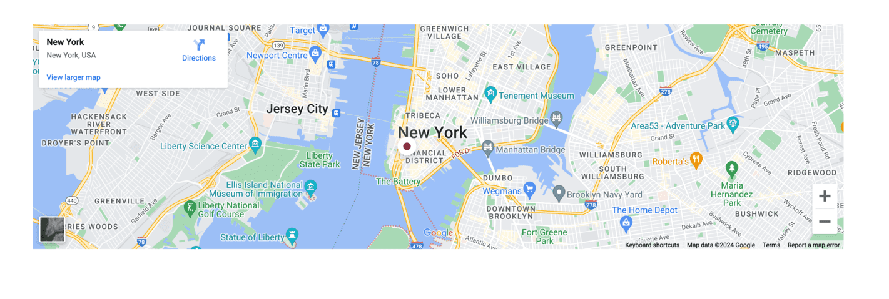

# Shortcode

Shortcode are small pieces of code that you can use to add predefined elements to your website. They are used to add
functionality to your website without writing any code.

## Usage

To use a shortcode, you can simply add the shortcode to the content of a page or a post.

For example, to add a Google Maps to a page, you can use the following shortcode:

```html
[google-map]New York, USA[/google-map]
```


The above shortcode will add a Google Maps to the page with the location set to `New York, USA`.

Go to the frontend of your website to see the result:



## Available Shortcodes
