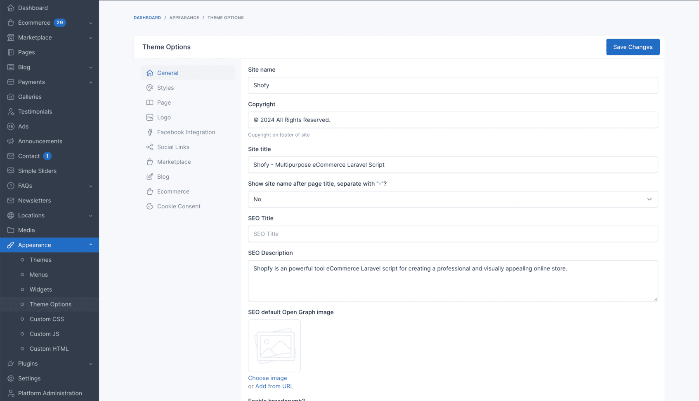
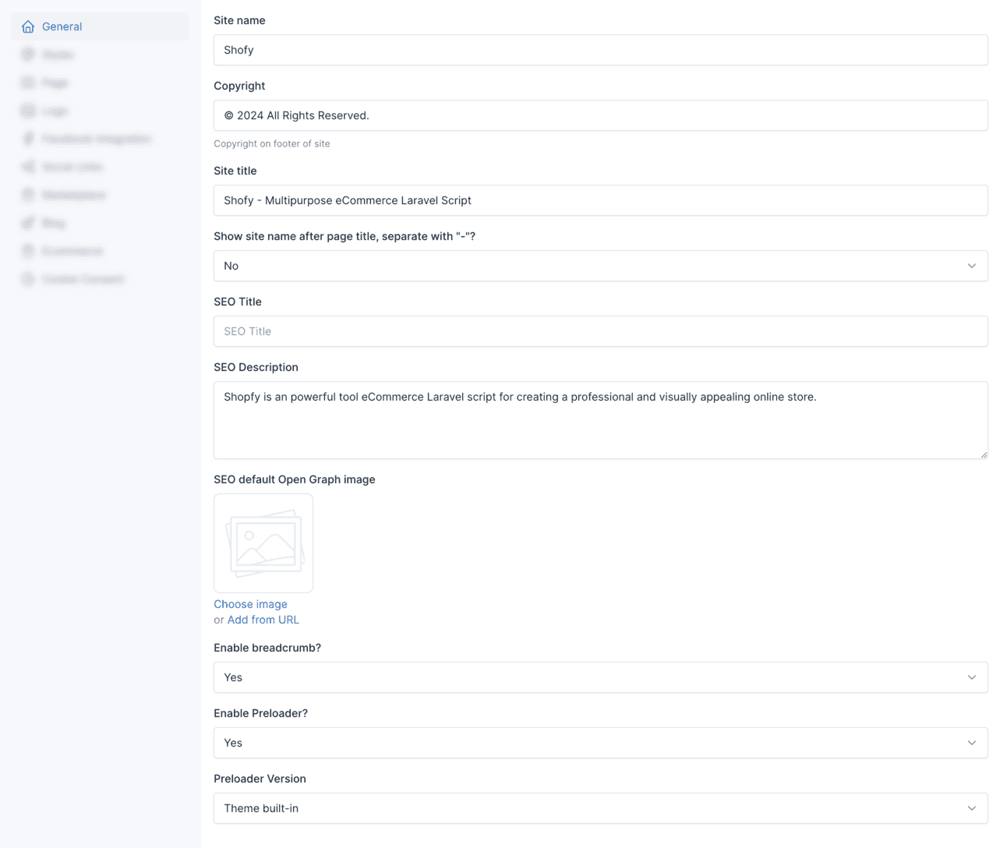
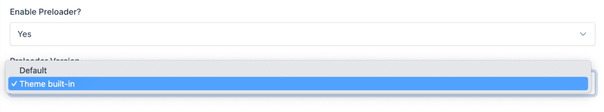
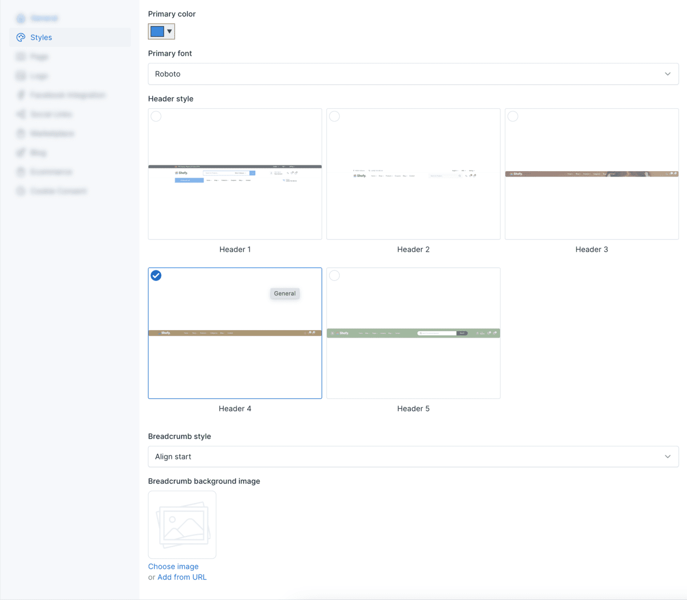
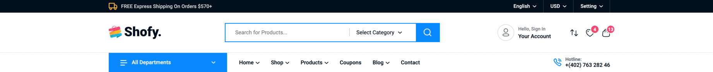
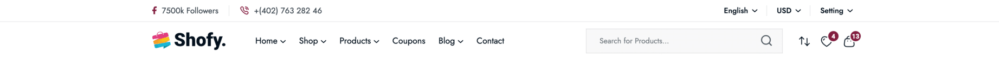
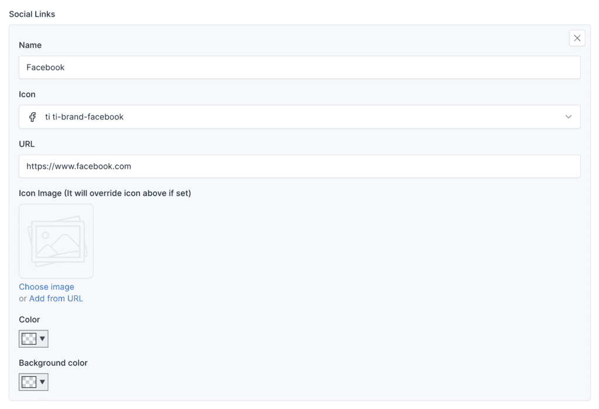

# Theme Options

Theme options are a great way to customize your theme. You can change the color, typography, layout, and more.

To access the theme options, go to `Appearance` -> `Theme Options` in your admin panel.

## General

The **General** tab allows you to configure fundamental settings that shape your website's identity and basic operation.

This section typically includes options for setting your site name, description, and other essential details.

### Preloader

The preloader is a small animation that appears while your website is loading. You can enable or disable it in the *
*General** tab.

## Styles

The **Styles** tab within the theme options empowers you to personalize the visual identity of your Shofy store.

### Header Style

The header style section allows you to choose between different header styles for your website. There are 5 predefined
header styles to choose from.

___

___

___

___

## Social Links

Social links are a great way to connect with your audience. You can add your social media links in the **Social Links**
tab.

Then, these links can be used in **[Site Information](./usage-widgets.md#4-footer-primary-sidebar)** widget, or in
**Contact Form** shortcode.

## Ecommerce

In here, there are various options to configure your shop that related to eCommerce features. You can set the number of products per page, products list
display style or even product item display style, and more.
