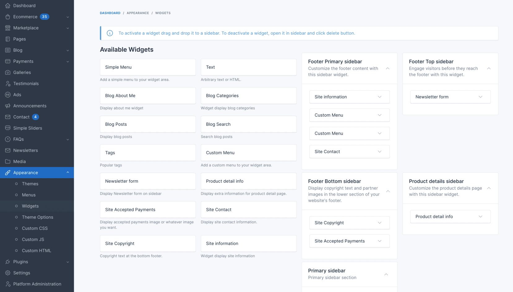
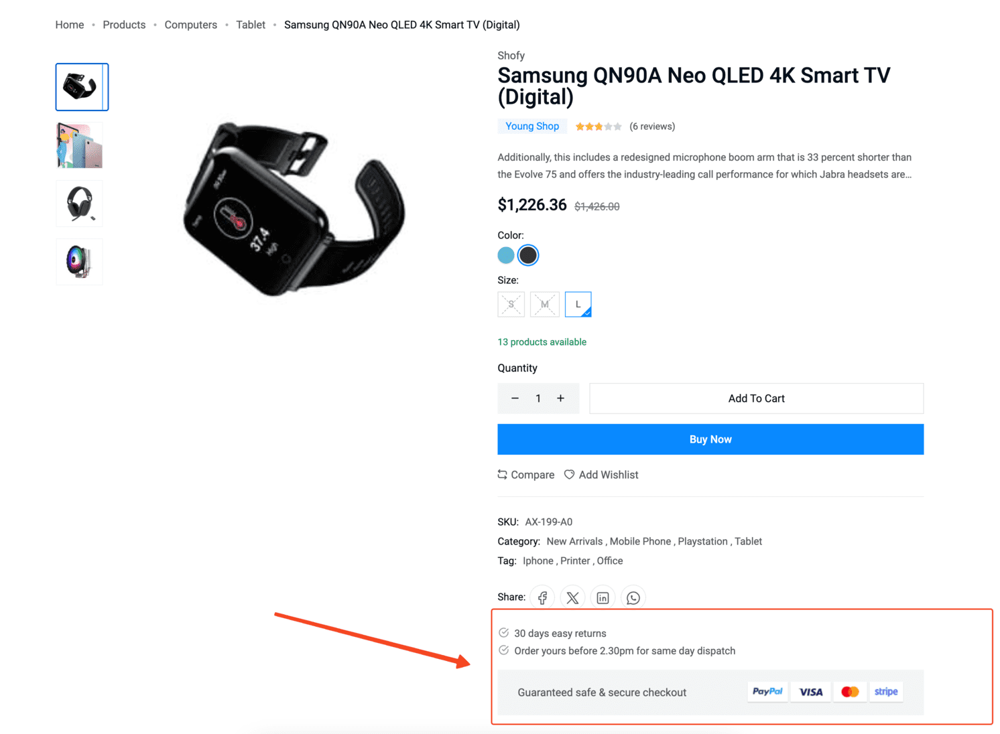
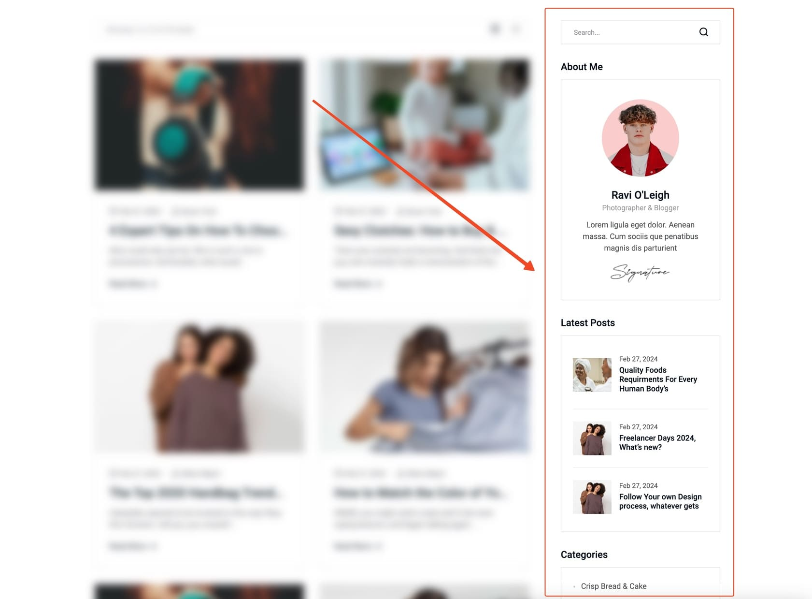
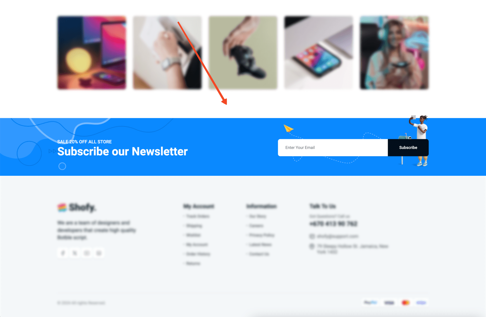
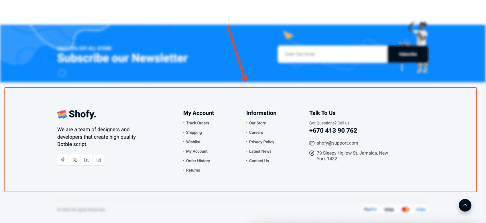
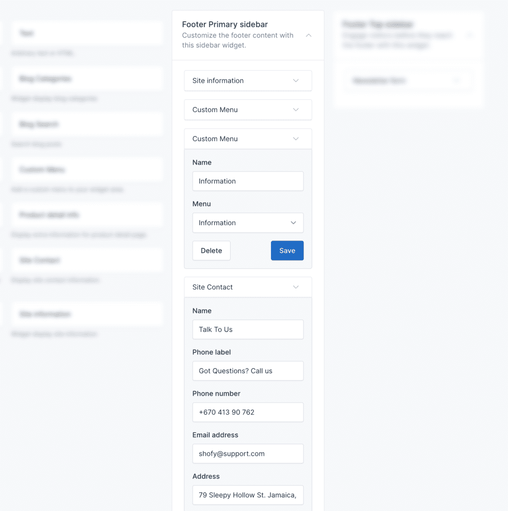
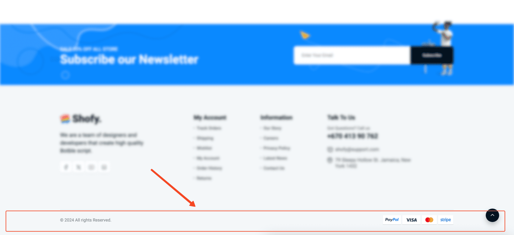
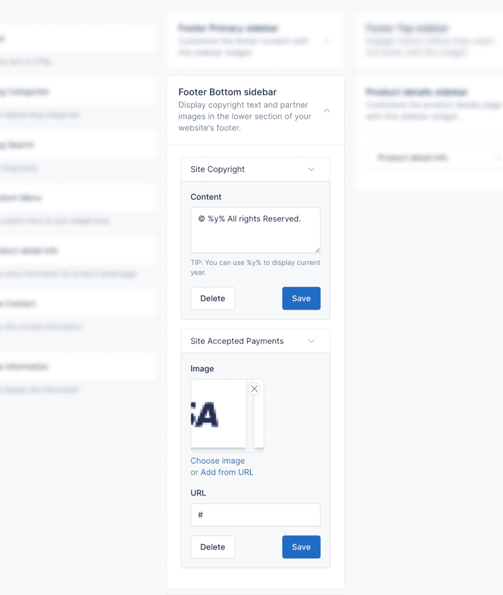
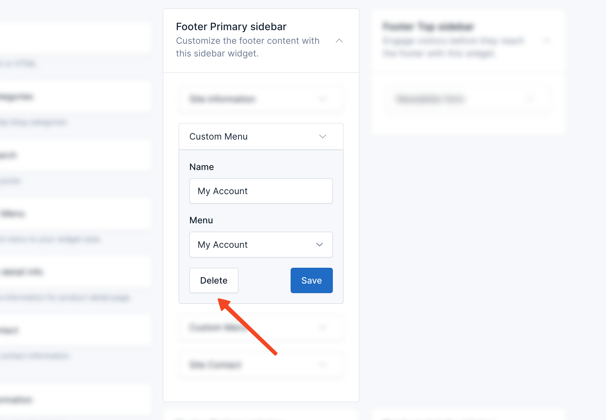

# Widgets

Shofy provides five pre-made widget areas to help you customize the user interface and organize content strategically.

These sidebars offer flexibility in placement and functionality, allowing you to tailor the user experience on different
sections of your online store.

## Manage Widgets

To manage the widgets, go to the `Appearance` -> `Widgets` menu in the admin panel.

To add a widget to a sidebar, drag and drop the widget from the left side to the sidebar area on the right side.

## Widget Areas

### 1. Product details sidebar

It appears on the right side of the product details page. You can use this area to display additional information about
the product, below is an example of using **Product detail info** widget.

### 2. Primary sidebar

Primary sidebar is the sidebar that appears on the right side of the blog page. You can use this area to display widgets
such as **Blog Search**, **Recent Posts**, **Categories**, etc.

### 3. Footer top sidebar

Located at the top section of the footer, this sidebar is ideal for grabbing user attention before they reach the bottom
of the page. It's perfect for displaying newsletter subscription forms.

In the example below, we use the **Newsletter** widget to display a newsletter subscription form.

::: tip
To use the **Newsletter** widget, you need to activate the **Newsletter** plugin in `Plugins` -> `Installed Plugins`.
:::

### 4. Footer primary sidebar

Occupying the central and often most prominent position in the footer, this sidebar is well-suited for showcasing
essential information like site information, menus, and contact details.

In the example below, we use:

* **Site Information** widget to display details about the site, logo, and social media.
* **Custom Menu** widget to display a custom menu.
* **Site Contact** widget to display contact details.

### 5. Footer bottom sidebar

Situated at the lowest section of the footer, this sidebar is typically used for displaying less visually prominent
information. It's often used to showcase copyright information, partner logos, or credit card icons.

In the example below, we use the **Site Copyright** and **Site Accepted Payments** widgets to display copyright
information and credit card icons.

## Delete Widgets

If you don't want to use the widgets in some areas, you can remove them by collapsing the widget and clicking the
**Delete** button.

